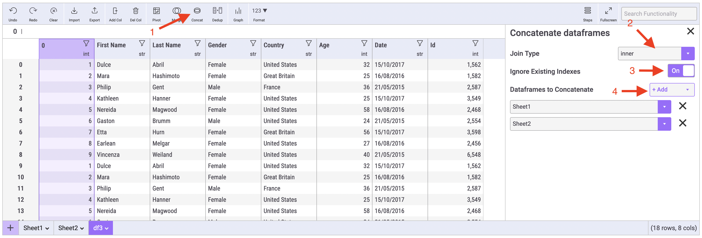

# Concatenate Dataframes

Concatenating dataframes allows you to combine two or more dataframes by stacking the rows on top of eachother. To concatenate multiple dataframes together into a new dataframe, simply click the Concat button in the toolbar, and then configure your concatenate.


Are you looking to combine two dataframes side by side using a shared key? You're looking to merge these datasets. Check out our documentation on merging datasets [here.](merging-datasets-together.md)


Then, choose the **Join Type** you'd like to use in your concatenate. There are two different types of joins possible when concatenating dataframes:

* **Inner:** Only includes columns that have matches in all sheets.
* **Outer**: Includes all columns from all sheets, regardless of if there is a match in the other sheets. Fills non-matching rows with NaN values automatically.&#x20;

Next, you have the option to ignore or keep the original indexes in the original dataframes. By default, Mito will reset the indexes in your newly merged dataframe.

Finially, set the dataframes you want to concatenate into a single new dataframe. Mito will automatically create a new sheet that represents this concatenate.

