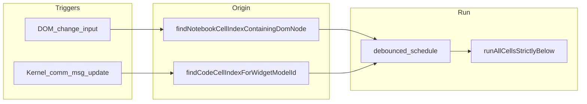

# Reactive Document Mode — intended behavior (spec)

This document states **what we want users to experience** in Document mode when notebooks use **ipywidgets** (and similar outputs). Use it to decide whether a bug is “wrong implementation” vs “undefined or out-of-scope behavior.”

---

## User-visible goal

In **Document** mode, the notebook should feel like a **read-oriented dashboard**:

1. **Controls** (sliders, date pickers, dropdowns, etc.) stay interactive in cell **outputs** (code inputs are hidden).
2. When the user **changes a control’s value**, **downstream** cells (everything **below** the cell that owns that control in notebook order) **re-execute** so tables, plots, filters, and markdown reflect the new value.
3. The **cell that created the control** must **not** be re-executed as part of that refresh, or the widget would be recreated from source and **values would snap back** to defaults.

**Non-goals for v1:** Re-running cells *above* the control cell; full dependency graphs (Marimo-style); automatic fixes for notebooks that snapshot scalars once and never read live widget `.value` in downstream cells.

---

## When a “reactive refresh” should run

A refresh means: **run all notebook cells with index strictly greater than the origin cell index** (`NotebookActions.runCells` on that slice), in order.

### Triggers (qualifying user intent)

We intend a refresh to schedule (subject to debounce and re-entrancy guards) when:

| Source | Intended meaning |
|--------|------------------|
| **Kernel** | Client → kernel **`comm_msg`** that represents a **ipywidgets trait update** (widget value / state the user cares about), not every comm (focus, layout, echo, etc.). |
| **DOM** (optional / supplementary) | **`change` / `input`** events whose target lies inside a **`.jp-OutputArea`**, so native controls (e.g. date inputs) still drive refresh when comm filtering is narrow or delayed. |

After a short **debounce**, coalesce rapid changes into **one** refresh.

### Learnings — different widget types (why two trigger paths exist)

ipywidgets are not uniform from the extension’s point of view. **Both** kernel comm and DOM matter because different controls surface user intent differently:

| Category | Examples (typical) | How the user’s change usually surfaces | Implication for reactive mode |
|----------|-------------------|----------------------------------------|--------------------------------|
| **Native HTML form controls** | `DatePicker` (often backed by `<input type="date">`), some text fields | **`change` / `input`** events on elements inside **`.jp-OutputArea`** | A **DOM-only** path can refresh even when comm filtering or origin-from-comm is imperfect. |
| **Sliders / composite Lumino views** | `IntSlider`, `FloatSlider`, many layout-backed controls | Often **kernel `comm_msg`** (trait `update`) during drag/release; **DOM events may be missing, inconsistent, or not equivalent to “value committed”** | Refresh **must** be reliable from **comm** once we resolve the correct **origin cell** for the widget’s `comm_id`. |
| **Container vs leaf** | `VBox` / `HBox` / `Tab` vs `IntSlider` inside them | Output MIME bundle often shows **one root** `widget-view` **model_id**; **children** have their **own** `comm_id` | Origin must still be the **code cell that displayed the container**; mapping **`child comm_id` → that cell** is required (nested state / live view walk), not only matching the root view id. |
| **Buttons / toggles** | `Button`, `Checkbox` | Mix of **click** and **comm** | Same as above: prefer comm trait updates for “real” value changes; DOM may need **`click`** if we extend listeners (v1 may rely on comm). |
| **Third-party / custom widgets** | `anywidget`, bespoke views | Varies widely | May need looser comm heuristics or explicit notebook hooks later; **fail closed** if origin cannot be resolved. |

**Takeaway:** Date-style controls can “work” with only a DOM path; sliders often **require** a correct **comm → origin cell** mapping. The product expectation is that **all** standard ipywidgets controls behave the same from the user’s perspective (downstream refreshes), so implementation must treat **slider-like** and **container-nested** cases as first-class, not edge cases.

**Implementation note (origin from live views):** After a trait `comm_msg`, we map `comm_id` to a code cell by scanning serialized outputs first, then the **live** Lumino tree under each cell’s `OutputArea`. ipywidgets do not put `model` on the bare Lumino `Widget`; they attach the Backbone `DOMWidgetView` as **`_view`**, with **`_view.model.model_id`** matching the comm. The live walk must include that bridge (not only `widget.model`), or nested controls such as `IntSlider` inside `VBox` can fail to resolve while native `DatePicker` still refreshes via DOM `change` / `input`.

### When a refresh must **not** run

- **Not in Document mode** (Notebook or App mode).
- **Wrong or unfocused notebook** (only the active Document-mode notebook panel for that session).
- While a **reactive refresh is already in progress** (avoid re-entrancy loops from our own `execute_request` traffic).
- **No resolvable “origin” cell** for the interaction (we cannot map the widget / comm to a cell index — then we should **fail closed**: do nothing rather than run the whole notebook or a wrong slice).

---

## What “render” / “re-execute” means per component

### Origin cell (index `i`)

- **Must not** be executed by the reactive refresh triggered from a control **owned by that cell**.
- Its **outputs** (including widgets) **remain on screen**; their state comes from the **kernel** and the live comm session, not from re-running the cell’s source.

### Cells strictly below (`> i`)

- **Code cells:** **Should** execute again (same as “Run” on each in order). Outputs are replaced/updated by normal Jupyter execution semantics.
- **Markdown cells:** **Should** run through the same machinery as `runAll` / `runCells` (typically **re-render** markdown into HTML output for that cell).

### Jupyter chrome (outside the notebook)

- **Mito top toolbar**, **Lab shell**, etc.: **No** re-execution; they are not notebook cells.

### Widgets inside the origin cell

- **Should not** be destroyed and recreated by re-running that cell (because we skip it).
- **May** still receive kernel comm updates and repaint (normal ipywidgets behavior).

### Widgets in cells below the origin

- If a **lower** cell **defines** another ipywidget and that cell **is** in the “below” slice, that cell **will** re-execute → that widget **can reset** (known limitation, same family as Marimo when a dependent cell also defines UI). **Mitigation:** structure notebooks so durable controls live **high**, and lower cells mostly **read** `.value` / traits and produce plots/tables.

---

## Origin resolution (what “owns” the control)

**Desired rule:** The origin index `i` is the **single code cell** whose output is the rightful “home” of the interaction: the cell whose `VBox([...])` / `display(...)` / last expression produced the widget UI the user touched.

**Implications:**

- **Nested widgets** (e.g. `IntSlider` inside `VBox`): the origin should still be the **same** cell that produced the **root** output (the VBox), because we **do not** re-run that cell; child widget `comm_id`s must map back to that cell.
- **Multiple top-level widget cells:** Changing a widget in cell 2 should use origin `2` and only run cells `> 2`, not re-run cell 2.

---

## Success criteria (acceptance checks)

1. **Single cell, VBox with DatePicker + IntSlider + downstream plot cell below:** changing **any** of the three controls schedules one debounced refresh; **plot cell runs**; **control cell does not**; **widget values do not snap back**.
2. **Only IntSlider moved (no date change):** same as above — **must** refresh downstream (this is the reported gap).
3. **Rapid drags on IntSlider:** at most one refresh per debounce window (or a small bounded number), not an unbounded storm of `runCells`.
4. **Switch to Notebook mode:** reactive triggers **stop**; no refreshes from Document-mode listeners.

---

## Related docs

- [reactive-document-mode-approaches.md](./reactive-document-mode-approaches.md) — design alternatives and why we chose “run below origin.”
